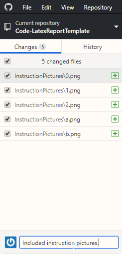

# Code-LatexReportTemplate
Automatically export matlab TABLES and pictures to your latex report.

You can directly import this to overleaf:

Then, if you have adapted your code, and changed some pictures, or made a table, upload your change back again to your github folder.
(It also automatically s the code in your report appendices, so no more copy pasting :))

Then you update your entire report, so tables, (vector) figures, and code with a single click in overleaf:

