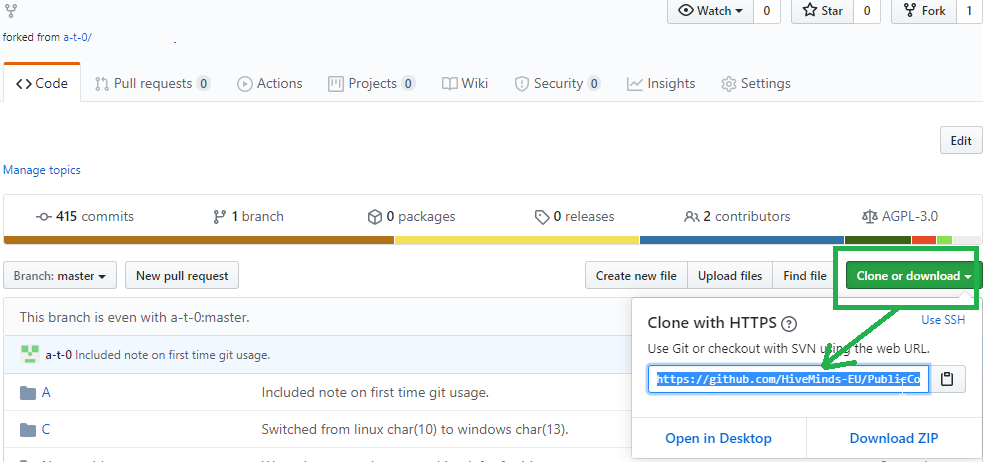
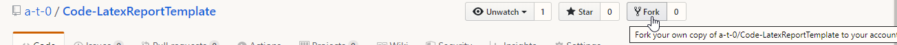
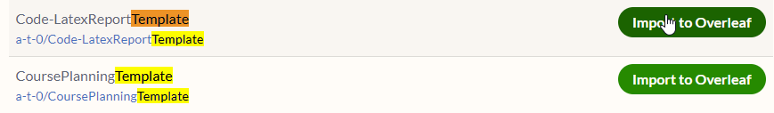
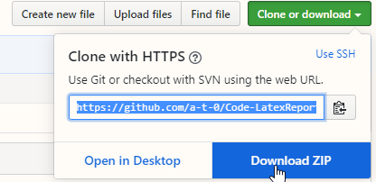
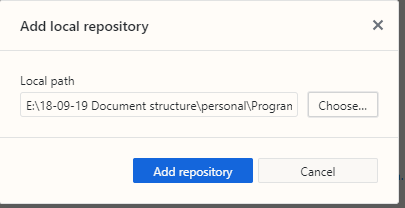
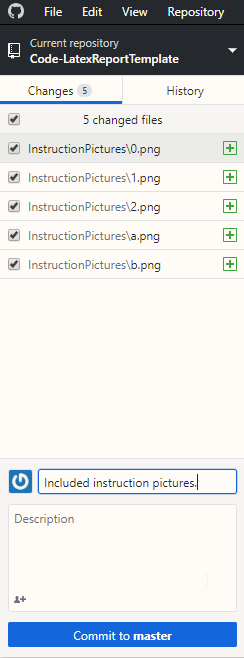
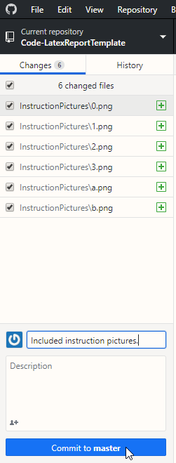
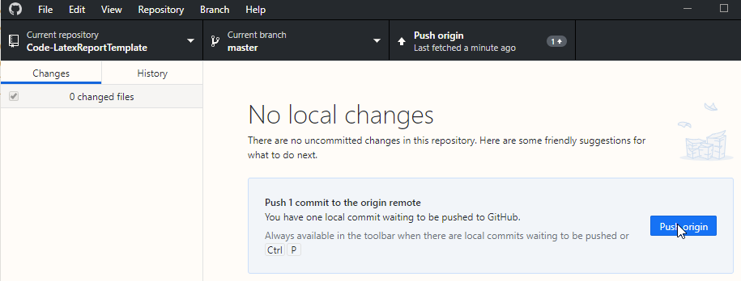
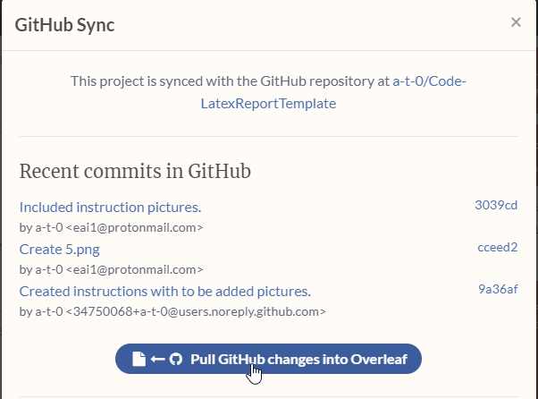

# Code-LatexReportTemplate
### What
This is a latex sample report which is syncred with git(hub). It (semi-)automatically syncs the code into your latex, and semi-automatically exports the plots into your report.

### Why
You don't have to do unnecessary work copy pasting pictures and creating report-layouts because it's semi-automated. (Semi- means in this case that you have to click "upload it to 'the  github cloud'", which at github is called push, and pull when you want to copy your work from the github cloud to the overleaf cloud).

### How
The basic idea is, you work on code in some folder `a` and on your report in some folder `b`. By putting folder `a` and `b` in the same folder `c`, your code automatically outputs your results into your report. A lot of people find it convienent to type reports in overleaf because of its user friendly environment. But it is a bit tedious/time consuming to copy paste your pictures and code everytime you change something. So to make it all synchronized, you sync your project with github, and sync your github with overleaf. Then you only have to click 3 times to get all your code and pictures in your report when you want to sync. (Also it is convenient to have 2 backups of your work).

### Instructions
0. Create a github account.
1. Download git from https://desktop.github.com/
2. Fork this repository:

2.a 


2.b 


2. Clone=download your fork of this repository:

2.a 



2.b 


4. if you want to work in overleaf (for convenience): 

4.a Get a(n) (free) overleaf account at https://www.overleaf.com.

4.b In: https://www.overleaf.com/project click: "New project>import from github" and select your (copy/fork of this) repository.




4.c



4.d


4.e Then, if you have adapted your code, and changed some pictures, or made a table, upload your change back again to your github folder.
(It also automatically s the code in your report appendices, so no more copy pasting :))

4.f



4.g



4.h



4.i



4.j




5. Then you update your entire report, so tables, (vector) figures, and code with a single click in overleaf:




5.a Now if you change something in your report, e.g. your code, pictures or text, you can do your first upload (called push) to github. 

5.b Note, first time you use github with command you probably need to login, but it'll ask you to do so if you need to.
5.c push your code to github by opening cmd, browsing into the directory of the repository with `cd` and use commands:
```
git status
```
5.c with that `git status` command you can see which files you changed, normally you add a particular file, but since it is a lot this time, you can also type `git add *` instead (instead of the git add commands below).

5.d Then upload your changes to your own repository with:
```
git pull
git add "some_folder/the_file_you_changed.py"
git add "some_other_folder/the_plot_you_created.jpeg"

git commit -m "Created a plot for something specific."
git push
```
